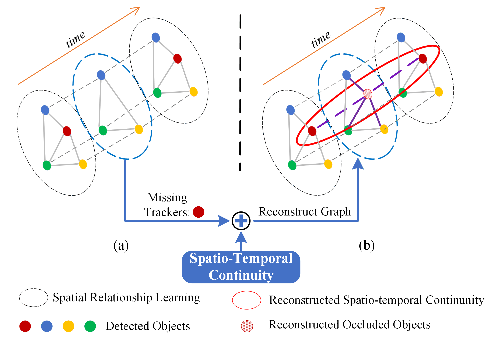
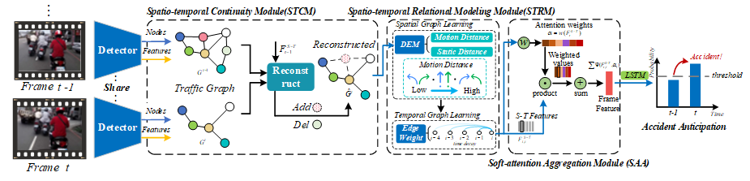

# GSC: A Graph and Spatio-temporal Continuity Based Framework for Accident Anticipation

 [](https://opensource.org/licenses/MIT)

The repository contains the source code and pred-trained models of our paper: `GSC: A Graph and Spatio-temporal Continuity Based Framework for Accident Anticipation`

<p align="center">

</p>

## Architecture
The overview of the network is showed below;

<p align="center">

</p>

## Prerequisites

- Python 3.6
- Pytorch 1.7.0
- Pytorch-Lightning 0.9.0
- Other required packages in `requirements.txt`

## Getting Started

### Create conda environment

```bash
conda create -n sspm python=3.6
source activate sspm
```

### Install the required packages

```bash
pip install -r requirements.txt
```

### Downloading MASKER_MD dataset and unzip it

- Access the datasets by [BaiduYun](https://pan.baidu.com/s/1TT3AZBBuE-u_zovl6i44iQ)[Passwards: `qo81`], and unzip it.

- Change the `data_root`
 of `configs/config.py` to your unzip path;

## Train the Model

- Run the following command in Terminal:
    ```bash
    python run.py --train ./configs/config.py
    ```

## Test the Model

- Change the `test_checkpoint` of `configs/config.py` to your model

- Run the following command in Terminal
    ```bash
    python run.py --test ./configs/config.py
    ```

## Visualize

<p align="center">

</p>
